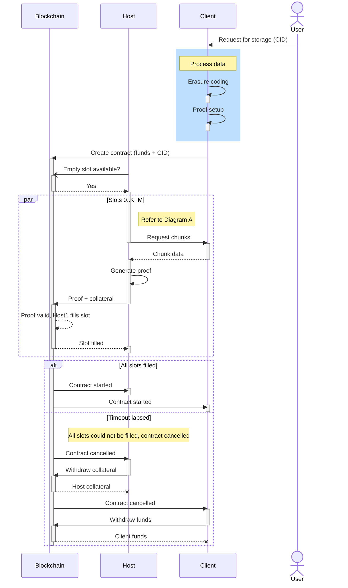

## How is "Durability" defined?

Codex uses the principles of Durability outlined below:

### Redundancy

We achieve this with the use of erasure coding techniques, which are overall superior to replication and have additional properties that contribute to durability.

### Uncorrelatedness

We achieve this with data placement techniques that minimize the likelyhood of data loss when a node or group of nodes fail.

### Repair

We use data auditing techniques to detect and repair data loss, thus maintaining expected levels of redundancy.

### Auditing

We rely on cryptographic techniques that detect data loss at scale in very large datasets and operate in byzantine environments.

### Incentives

We use incentives to compensate for resources contributed to the system and increase it's overall sustainability.

## How does Codex Work?

The following diagrams below detail how the Codex client is interacted with by all network participants to ensure "data durability" of a file uploaded by an end user.

*Diagram A. Persisting a file on the Codex Network.*

In this basic use case, a user can upload a file to a client, and eventually the client can exit the network while the file is still available for download from other nodes. This illustrates that the file is persisted on the network without the client needing to remain online.

Once the file is uploaded to the Client (1), the file is split in to chunks and each is added to a manifest (2). The manifest and each chunk have a unique Content Identifier (CID). Each chunk and the manifest are persisted on the client locally (3) and then announced to the Codex network, declaring to all participants in the network that the chunk/manifest for the given CID is located at the PeerID of the Client (4).

Before the client can safely leave the network and have the data remain on the network, another node must download the manifest and all the chunks, then announce that the manifest/chunks exist at their PeerID. Host1 decides to host the file and must download the file. Host1 submits the manifest CID to the network (6) and is returned a PeerID of the closest node that has the manifest, which in this case is Client. Once the PeerID of Client is returned (7), Host1 downloads the manifest (8-9), announces the that it has the manifest to the network (10), and then downloads all the chunks in the manifest (11-12), announcing each chunk as it is downloaded (13).

At this point, the client can go offline (14) and the next request to the network for the manifest’s CID will return the PeerID of Host1 (15). For any other node that wants to host the file, the process is the same as it was for Host1.

Host2 decides it wants to download the file. It sends the manifest CID to the network (15) and gets back the PeerID of Host1 (16). Host2 then sends the manifest CID to Host1 (17), and in return gets the manifest data (18). Host2 announces it has the manifest to the network (19). Host2 then downloads each chunk in the manifest from Host1 and announces its presence on Host2 to the network (20-22).

*Diagram B. Marketplace: pay to store data*

Persisting a file on the Codex Network does not guarantee that the file will be retreivable for any period of time. This concept, known as "data durability", is fundamental to Codex and ensuring comes with several requirements.

Firstly, users must pay for hosts to store their data. Codex handles this in storage contracts, and storage is requested and filled in the Marketplace. Secondly, hosts must prove, using mathmatical proofs, that data is retreivable on the network, through a concept called Proof of Retreivability (PoR). Finally, data losses must be tolerated up to a certain point, with files being repairable in the case of some data loss. This is enabled by the use of erasure codes, dispersion in the network, and repair (see "Repair").

#### Marketplace
As a part of data durability, when a user/client wants to persist a file on the Codex Network, they must enter into a storage contract with hosts and fund the contract. Contracts will have storage slots that can be filled by hosts. Hosts that want to store data for clients will volunteer themselves to fill a slot, and notify the contract with a valid proof and collateral (to prevent bad/malicious behaviour). If all the slots are filled, the contract is started. If the timeout elapses before all slots are filled, the contract is considered cancelled, and the client can withdraw their funds.

Note: the following process assumes User is running Client, and Client contains funds that User controls.

This process starts with User uploading data to Client (refer to Diagram A). Once uploaded, User sends a request to Client to store the data (1). The data, which is already on Client, is erasure coded (2), and PoR proofs are setup using the erasure-coded chunks (3). Client submits a transaction on the blockchain to create a storage contract, supplying it with funds to pay for storage, a CID of the data to store, and parameters such as expiry and max price (4).

Host would like to offer to store Client's files for the price in the storage contract. Host queries the storage contract to find out that there are empty storage slots available (5-6). In order to fill the slot, Host must first download the data (CID) in the contract (7-8, refer to Diagram A), generate a proof from the data (9), and then submit the proof plus collateral to the contract (10). If the proof is valid, the contract records the slot as being filled by Host (11) and notifies the Host (12). This sequence can happen in parallel for all empty slots in the contract.

Once all available the slots have been filled, the contract is considered started and Host and Client are notified (13-14). However, if all slots were not filled before the contract's timeout elapsed, the contract is considered cancelled. Once cancelled, Host is notified (15), and can then withdraw its collateral (16-17). Client is also notified on the cancellation (18), and can withdraw funds from the contract (19-20).
